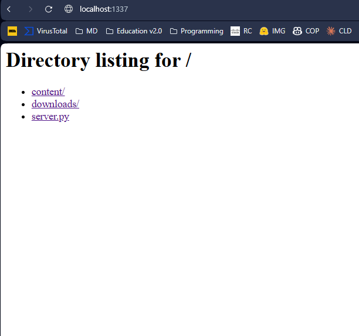
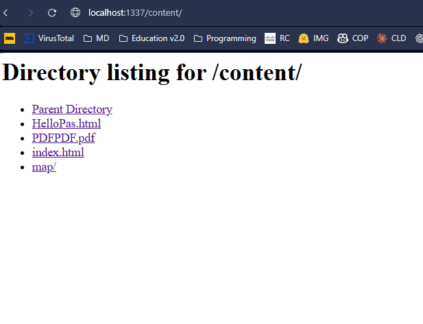
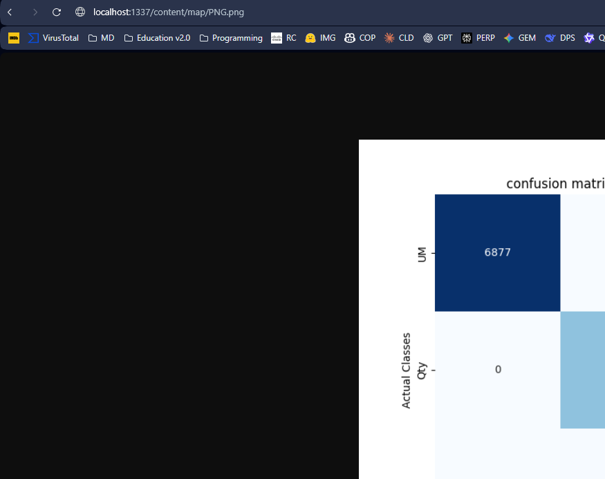

# Lab 1 Bozadji Artiom

## Project Structure

```
Lab1/
├── docker-compose.yml
├── Dockerfile.server
└── Dockerfile.client
├── content/
│   ├── helloOas
│   ├── index.html
│   └── pdfpdfpdf.pdf
└── downloads/
```

## Docker Commands

### Build all containers
```bash
docker compose build --no-cache
```

### Run Server
```bash
docker compose up server -d
```

### Run Client
```bash
docker compose run --rm client http://server:1337/content/index.html /app/downloads
```

### Stop all containers
```bash
docker compose down
```

### Clean up
```bash
docker compose rm -f
```

## Example Output


## Example of running server






```bash
docker compose run --rm client http://server:1337/content/index.html /app/downloads
time="2025-10-12T16:25:30+03:00" level=warning msg="C:\\Users\\Blago\\Documents\\pr_labs\\Lab1\\docker-compose.yml: the attribute `version` is obsolete, it will be ignored, please remove it to avoid potential confusion"
[+] Creating 1/0
 ✔ Container mini_server  Running
Connected server:1337
Saved: /app/downloads/content/index.html
Saved: /app/downloads/content/index.html
```

## Notes
- The server runs on port 1337
- Content files are served from the `content/` directory
- Downloaded files are saved to the `downloads/` directory
- The client can download various file types (HTML, PDF, etc.)
- Server runs in detached mode with `-d` flag